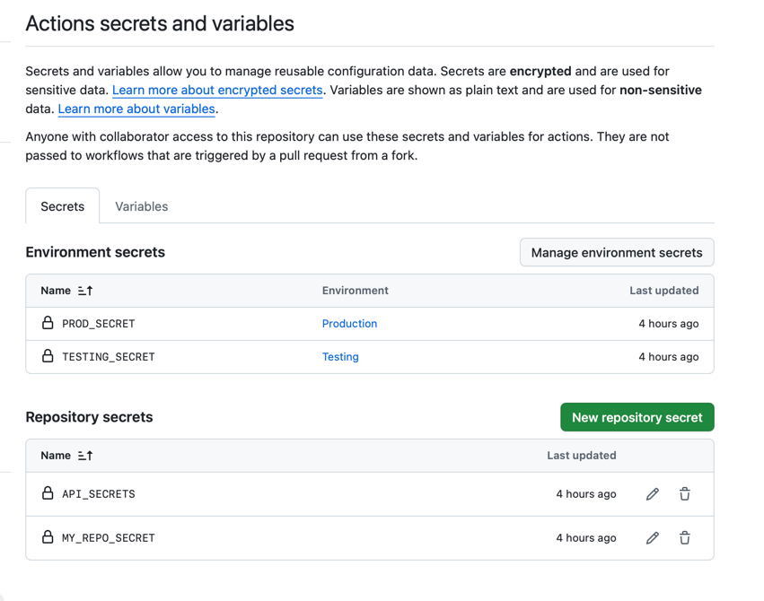
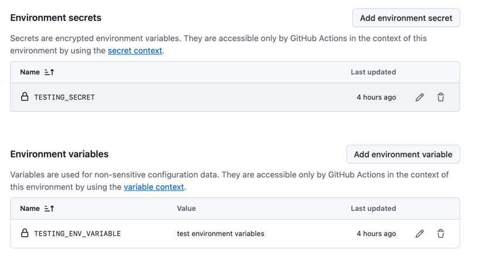

## Demo of Java 21 Features
## Demo of RestClient of SpringBoot 3.2.1
## Demo of JdbcClient of SpringBoot 3.2.1
## Demo of Spring-AMQP
## Demo of Spring-Security using JWT

# GitHub Actions CI/CD Pipeline
### 1. Java Application Building and Testing with Gradle (app-gradle-build.yml)
### 2. Upload the artifact to github space (upload-artifact.yml)
### 3. Upload and download the artifact for deployment (downlod-artifact.yml)
### 4. Read the jar file from github space and print into console in another job (read-generated-jarfile-name.yml)
### 5. Cache Gradle dependencies to speed up build times (dependency-caching.yml)
### 6. Definition of environment variable at job and workflow level (env-variable.yml)
### 7. Using GitHub Secrets in Workflows (github-secrets.yml)

### 8. Using Github Sectets environment-wise (evironment-secrets.yml).

### 9. Using of if statement and special conditional methods (conditional-build-test.yml)
### 10. Enhance caching using of conditional methods (conditional-caching.yml)
### 11. Using of GitHub Actions Matrix strategy for multiple JDK versions and OS (matrix-strategy.yml)
### 12. Demonstration of reusable workflows (reusable-workflow.yml, reusable-workflow-caller.yml)
### 13. Custom Composite Actions (custom-composite-action.yml, actjions/composite-action/action.yml)